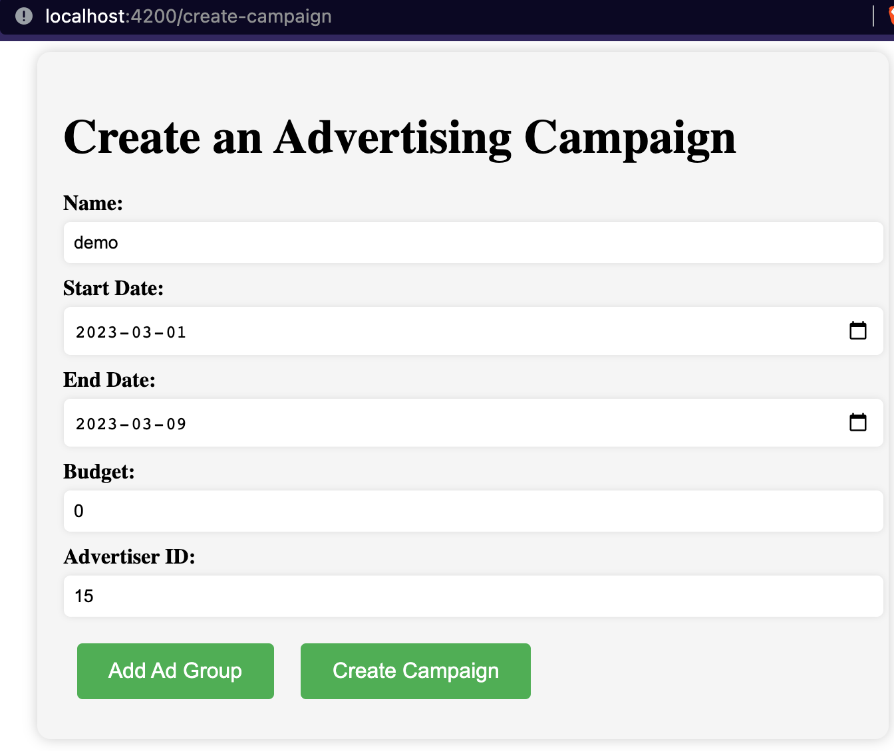
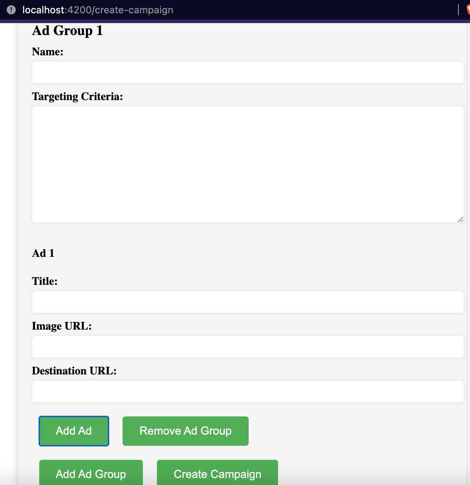

# Angular Typescript Ad Management
Angular Typescript Ad Management allowing users to create ad campaigns, modify campaigns, modify ad groups and modify ads.

## Screenshots





This project was generated with [Angular CLI](https://github.com/angular/angular-cli) version 15.2.0.

## Development server

Run `ng serve` for a dev server. Navigate to `http://localhost:4200/`. The application will automatically reload if you change any of the source files.

## Code scaffolding

Run `ng generate component component-name` to generate a new component. You can also use `ng generate directive|pipe|service|class|guard|interface|enum|module`.

## Build

Run `ng build` to build the project. The build artifacts will be stored in the `dist/` directory.

## Running unit tests

Run `ng test` to execute the unit tests via [Karma](https://karma-runner.github.io).

## Running end-to-end tests

Run `ng e2e` to execute the end-to-end tests via a platform of your choice. To use this command, you need to first add a package that implements end-to-end testing capabilities.

## Further help

To get more help on the Angular CLI use `ng help` or go check out the [Angular CLI Overview and Command Reference](https://angular.io/cli) page.


## Other Commands

```cli

Component ng g component my-new-component
Directive ng g directive my-new-directive
Pipe ng g pipe my-new-pipe
Service ng g service my-new-service
Class ng g class my-new-class
Interface ng g interface my-new-interface
Module ng g module my-module
Web worker ng g web-worker my-web-worker

```